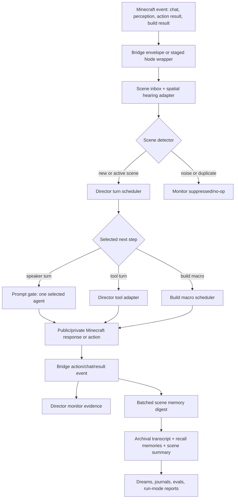

# Minecraft Director V2 Architecture

Issue: #750 / E8.5-1

Parent epic: #749 - Epic E8.5, Minecraft Director V2 + Tool Parity

Predecessor: #510 - E8, All Agents Embodied + Decentralized Conversation

Decision record: [0011-director-v2-architecture.md](../decisions/0011-director-v2-architecture.md)

## Summary

Director V2 is the post-#510 Minecraft showrunner. It sits between raw
Minecraft bridge events and bot/model prompts. Its job is to make embodied runs
scale and stay watchable: detect scenes, select the next speaker or action,
route only useful context, schedule tools/builds, and write a meaningful scene
summary.

It is not Management censorship and not a central blueprint planner. Agents
still speak and act in character. Director V2 decides turn ownership and context
boundaries so one world event does not prompt every nearby bot at once.

## Why This Exists

Epic #510 proved the embodied path can run with all agents, profile routing,
the bridge, action queues, public chat, and soak evidence. It also exposed the
next bottleneck: decentralized bot response logic can scale with nearby agents
instead of selected scene turns.

The old Python `ConversationEngine` had useful show semantics:

- One chosen speaker at a time.
- Bounded turns and a clean close.
- Memory-backed context assembly.
- Tool-call rounds.
- End-of-scene records that later systems can read.

The current Mindcraft path has useful embodiment semantics:

- Real positions, actions, inventories, and public chat.
- Mindcraft's external `mindcraft/src/agent/conversation.js` respond/ignore
  path, plus this repo's staged wrappers such as
  `scripts/minecraft/fork-src/agent/skills/inbox_queue.js`.
- Per-agent action queues and local-model soak evidence.

Director V2 combines those strengths without restoring the old office-room loop
as the runtime owner.

## Side-By-Side Comparison

| Concern | Legacy Python loop | Current #510 Mindcraft respond/ignore | Director V2 |
| --- | --- | --- | --- |
| Runtime owner | `core/conversation_engine.py` owns the active conversation. | Mindcraft bots and staged wrappers own local prompt timing. | Python Director V2 owns scene turns; Node bots execute selected prompts/actions. |
| Input | Trigger events in Python, usually tied to a location like `town_square`. | Public chat, private bot conversation, action logs, and local wrappers. | Bridge events, public chat, action results, perception snapshots, and spatial hearing. |
| Speaker selection | `SpeakerSelector` uses `time_since_spoke`, `topic_relevance`, `chattiness`, `adjacency_fit`, and `random_jitter`. | Each bot may run respond/ignore logic; local inbox batching reduces races but does not choose one global speaker. | Reuses legacy scoring vocabulary and selects one next speaker/action for the scene. |
| Prompt fanout | One selected agent per turn. | Can scale with bots that hear the event or chat batch. | Prompt count scales with selected scene turns. Suppressed fanout is logged. |
| Context | `ContextAssembler` builds per-agent memory-backed context. | Mindcraft profile and chat history are the main local context, with bridge additions. | Director routes a compact scene digest plus per-agent memory context to the selected agent. |
| Memory | Conversation close stores transcript, creates recall memories, and produces a structured record. | Embodied events are logged, and memory bridge paths exist, but raw activity can be noisy. | Batches scene memory compaction and writes end-of-scene summaries. |
| Tools | `core/tool_executor.py` handles tool schemas and bounded tool rounds. | Mindcraft command/action surface plus bridge tools. | Tool adapter classifies valid tools as callable, approval-gated, deferred, or retired. |
| Builds | Conversation nudges can encourage tools, but build macros are not a first-class scene scheduler. | Agents may duplicate build requests without a shared scheduler. | Builder macro scheduler budgets and de-duplicates plan/build calls. |
| Scene ending | Energy/turn limits produce close lines and summaries. | Runs often rely on time, action completion, or chat quieting. | Scene detector closes on energy, quiet windows, goal completion, or budget limits. |
| Observability | Selection logs, energy logs, prompt logs, and conversation records. | Soak logs, timeline events, inbox/action queue telemetry, rough respond/ignore counts. | Director monitor emits selected turns, suppressed fanout, queue depth, stale responses, tool calls, compactions, and build outcomes. |
| Management boundary | Public agent utterances can pass through Management before TTS/output. | E8-7 keeps visible bot chat reviewed out of band. | Private scene orchestration is not Management-censored; visible public chat/TTS/external comms stay gated. |

## Director V2 Responsibilities

### Scene Detection

`core/minecraft/director/scene_inbox.py` and `spatial_hearing.py` should collect
raw bridge events into scene candidates:

- Public chat from nearby agents or viewers.
- `perception.report` snapshots from the bridge.
- `action.result` outcomes.
- Builder/action queue telemetry that changes scene state.
- Spatial scope: who is near enough to hear, see, or be affected.

The scene detector should avoid prompting on telemetry-only noise and should
batch repeated events into one scene update.

### Turn Scheduling

`core/minecraft/director/turn_scheduler.py` owns the next-turn decision. It
should reuse the legacy selection vocabulary from
`core/conversation/speaker_selector.py`:

- `time_since_spoke`: avoid silent agents disappearing.
- `topic_relevance`: prefer agents who can move the scene forward.
- `chattiness`: preserve character differences.
- `adjacency_fit`: preserve natural pairings, factions, and relationship fit.
- `random_jitter`: keep scenes from becoming deterministic.

Minecraft-specific inputs add:

- Distance and line-of-sight/hearing scope.
- Current action state and action queue depth.
- Recent verified action/build outcomes.
- Builder budget state.
- Stale or discarded response count.

The scheduler chooses one of three next-step types:

- Speaker turn: one selected agent receives one prompt.
- Tool turn: a typed backend tool is called through the adapter.
- Build macro turn: a plan/build macro is scheduled through the builder budget.

### Event Routing

Director V2 routes context by need, not by broadcast. Agents can still overhear
nearby public events, but the model prompt should only include compact facts
that matter to the selected turn.

Routing output should distinguish:

- Heard by agent.
- Visible to agent.
- Relevant to current goal.
- Stored only for scene memory.
- Suppressed from prompting to avoid fanout.

### Memory Digesting

`core/minecraft/director/memory_digest.py` batches scene memory work. The target
shape mirrors the old conversation close:

- Archival transcript for the scene.
- Per-agent recall memories for participating or meaningfully observing agents.
- Structured scene record with summary, outcome, key decisions, unresolved
  tensions, novel information, build outcomes, and tool outcomes.
- Compact digest redistributed to agents in later prompts.

This preserves the 3-tier memory boundary. Director V2 should not write noisy
raw event streams into core memory.

### Tool Invocation

`core/minecraft/director/tool_adapter.py` classifies tool parity for Minecraft
scenes:

- Callable now: safe, typed, bridge-compatible tools.
- Approval-gated: tools that can affect external comms, spend, code execution,
  or public artifacts.
- Deferred: valid tools that need more bridge or UX work.
- Retired: tools that no longer make sense in the Minecraft embodiment.

No tool adapter may expose a generic "run arbitrary Python" path. Existing
approval, cost, kill-switch, and sandbox boundaries remain in force.

### Builder Macro Scheduling

`core/minecraft/director/build_scheduler.py` owns shared build macro timing:

- One active build macro per relevant scene or agent budget.
- De-duplicate repeated `planAndBuild` requests.
- Respect existing builder caps and cooldowns.
- Route successful or failed build outcomes back into scene memory and monitor
  evidence.

The scheduler budgets macros; it does not mandate the whole world's design.

### Observability

`core/minecraft/director/monitor.py` should emit evidence that explains:

- Scene creation and close reason.
- Selected speaker/tool/build action.
- Candidate scores and chosen reason.
- Suppressed fanout count.
- Prompt queue depth and latency.
- Stale or discarded responses.
- Tool calls and results.
- Memory compaction batches.
- Build macro starts, completions, failures, and budget denials.

Every artifact must include the runtime mode, especially
`CONVERSATION_MODE=director_v2`, so it cannot be confused with #510 evidence.

## Non-Responsibilities

Director V2 does not:

- Run Management censorship on private scene candidates, private sim talk, or
  scheduler state. Visible public chat, TTS, external communications, and
  approval-gated tools still use the existing Management or human approval
  gates.
- Replace dreams, journals, reflection, or long-horizon planning. It produces
  higher-signal scene records for those systems to consume.
- Force a central construction blueprint. It schedules and budgets build macros
  while preserving character-driven choice.
- Delete the #510 decentralized mode.
- Reassign per-agent model choices from `agents/<id>/config.yaml`.

## Event Flow



ASCII version:

```text
Minecraft event
  -> bridge envelope / Node wrapper
  -> scene inbox + spatial hearing
  -> Director turn scheduler
  -> one selected next step:
       speaker prompt, typed tool call, or builder macro
  -> Minecraft chat/action/build result
  -> monitor evidence
  -> batched memory digest
  -> archival transcript + recall memories + scene summary
```

## Runtime Mode Plan

The compatibility boundary is `core/conversation_mode.py` and
`CONVERSATION_MODE`:

| Mode | First implementation behavior |
| --- | --- |
| `director` | Existing Python director for non-Minecraft simulation paths. |
| `embodied` | Current #510 decentralized Minecraft path. Preserve this exact spelling for old scripts and evidence. |
| `decentralized` | Future explicit alias for `embodied`, useful in run specs and #514 docs. |
| `director_v2` | Opt-in Director V2 path. It must not become implicit through a launcher side effect. |

Launcher scripts and soak reports should print the selected mode. Later #514
run specs can expose this as a structured field, but they should preserve the
environment mapping for local scripts.

## Compatibility Plan For #510 Evidence

#510 remains a valid milestone for decentralized embodied behavior. Director
V2 does not rewrite that evidence. Treat historical #510 artifacts as
decentralized evidence only.

- `CONVERSATION_MODE=embodied` remains the current #510 mode.
- Existing #510 artifacts in [cohort-report.md](cohort-report.md) and
  [multi-agent-soak.md](multi-agent-soak.md) should be read as decentralized
  evidence only.
- Director V2 soak artifacts must live under a distinct run mode label and
  should not reuse #510 pass/fail conclusions.
- Existing public-chat and inbox queue wrappers remain useful in decentralized
  mode and may be reused beneath the Director V2 prompt gate.
- Comparison reports should show both modes when available:
  decentralized baseline vs. `director_v2` selected-turn behavior.

## Handoff To Later Epics

### #511 - Dreams / Journals / Website Publishing

#511 should consume Director V2 scene records instead of raw Minecraft noise:

- Scene summary.
- Participants and meaningful observers.
- Key decisions and unresolved tensions.
- Tool and build outcomes.
- Per-agent contribution notes.

This lets dreams and journals reflect real directed activity rather than a
large transcript of unselected chat and stale responses.

### #512 - Eval & Reporting

#512 should use Director V2 monitor output as first-class eval/reporting input:

- Selected turn count.
- Suppressed fanout count.
- Prompt queue depth and stale-response discard count.
- Tool-call attempts and outcomes.
- Memory compaction count and latency.
- Builder macro budget decisions and verified build results.

Eval loaders should still support #510 decentralized runs, but Director V2
artifacts become the cleaner target for comparing collaboration quality,
legibility, and cost scaling.

### #514 - Run Mode / Starting Conditions

#514 should expose Director V2 as a run-mode choice and feed it the starting
conditions it needs:

- Agent set and spawn locations.
- Personas/backstories from `agents/<id>/config.yaml`.
- Factions, goals, and relationships.
- Memory seed or blank-slate mode.
- World seed/config.
- Persistent 24/7 vs. experimental short-run semantics.

Director V2 must land before #514 wires those knobs deeply, otherwise run modes
will encode the #510 fanout behavior as the default scale model.

## Implementation Order Across #749

1. #751 builds the scene inbox and spatial hearing adapter.
2. #752 ports legacy speaker-selection semantics into a Minecraft scheduler.
3. #753 gates Mindcraft bot prompts through the Director V2 queue.
4. #754 batches scene memory compaction and digest distribution.
5. #755 inventories tool parity and adds the callable tool adapter.
6. #756 schedules builder macros and budgets.
7. #757 adds the monitor/evidence surface.
8. #758 runs the acceptance soak.

Each issue should keep `CONVERSATION_MODE=embodied` working until the final
comparison evidence exists.

## Open Integration Assumptions

- The external fork path `mindcraft/src/agent/conversation.js` remains the
  stock conversation owner in decentralized mode; this repo stages overlays
  into the git-ignored `./mindcraft` clone.
- The bridge envelope from
  [0010-bridge-protocol.md](../decisions/0010-bridge-protocol.md) remains the
  cross-language transport.
- Builder/model routing remains driven by agent config and local launcher env.
- Director V2 may use current public chat for visible coordination, but private
  scheduling metadata should stay internal unless deliberately surfaced through
  monitor/evidence.

## Verification

This issue is documentation-only. No runtime behavior changes are required.
Review should confirm:

- The ADR and this companion doc distinguish Director V2 from Management and
  from long-horizon planning.
- The event flow covers Minecraft event -> selected speaker/tool/build action
  -> memory summary.
- #510 compatibility remains explicit.
- #511, #512, and #514 handoffs name concrete Director V2 outputs.
